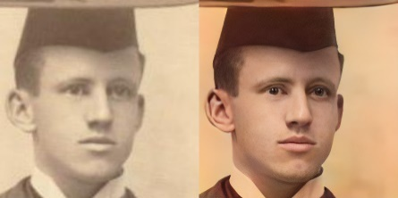
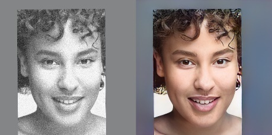
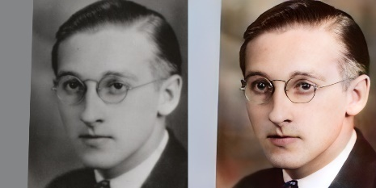
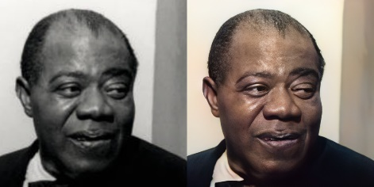
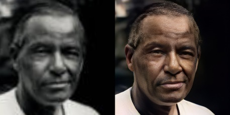

# Meta GANS for Progressive Image Processing

## Description ℹ️

This is an Implementation of for the paper [Link]

## Description 📝

Meta-GAN is a model designed to enhance the quality of low-resolution facial images by utilizing a Generative Facial Prior derived from a pre-trained facial generation 
model, addressing challenges such as blur, low resolution, and noise while simultaneously enhancing facial details and correcting colors in a single pass of the neural network

## Download 📁

You can use the Google Colab link to Download and Run the Program

https://colab.research.google.com/drive/1sRqU9sN9bLUeiZCq9T8IuxUkes_lqjmm?usp=sharing

## Requirements 🛠️

Install all the required Libraries of Python.
GPU is a must to train the Machine Learning Model.

## Using Meta-GANs

Happy coding! 🖥️🔍
